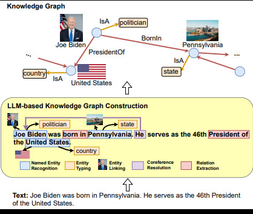
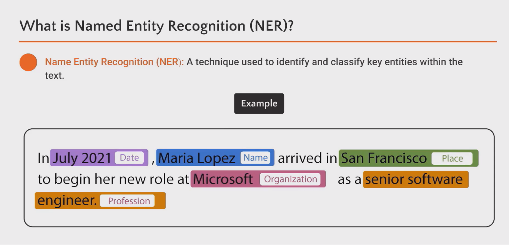
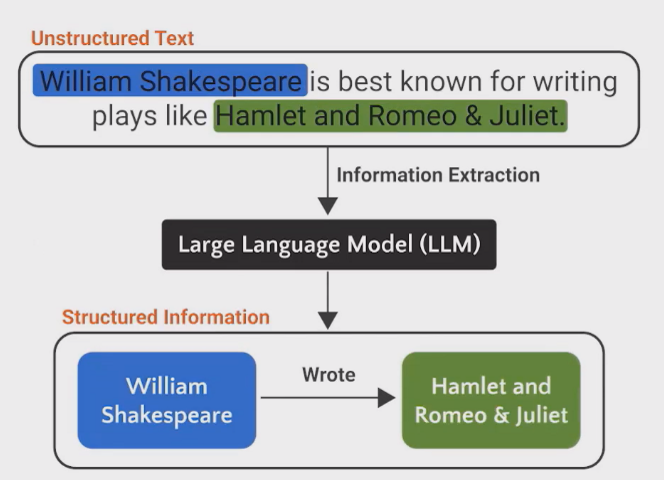
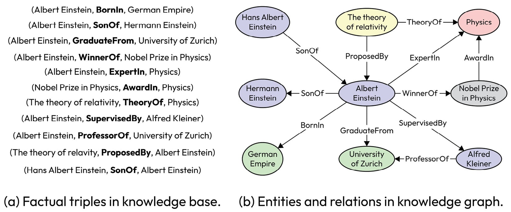

# Concepts

## 1. What Are Knowledge Graphs?



A Knowledge Graph (KG) is a structured representation of real-world facts, where information is modeled as a graph of entities (nodes) connected by relationships (edges).

At its core, a knowledge graph stores information in the form of factual triples:

```
(SUBJECT) — (PREDICATE) → (OBJECT)
```

For example:

```
(Tata Motors) — OWNS → (Tata Motors Commercial Vehicles)
```

Unlike traditional tabular data, knowledge graphs explicitly capture meaning, context, and relationships between data points.

### Why Knowledge Graphs Are Useful

Knowledge graphs excel at:

- Representing complex, interconnected information
- Enabling semantic understanding rather than just keyword matching
- Supporting reasoning, inference, and discovery
- Handling heterogeneous data (text, numbers, entities, hierarchies)

### Common Use Cases

Knowledge graphs are widely used in:

- Search engines (semantic search, entity-aware search)
- Recommendation systems
- Enterprise data integration
- Financial analysis and risk modeling
- Fraud detection
- Healthcare and life sciences
- AI assistants and chatbots
- Regulatory compliance and auditing

## 2. Why LLMs Benefit from Knowledge Graph Grounding

Large Language Models (LLMs) are powerful pattern learners, but they:

- Do not inherently know what is true
- Can hallucinate facts
- Lack persistent, structured memory
- Struggle with multi-hop factual reasoning

### Knowledge Graphs as a Source of Truth

Grounding LLMs with knowledge graphs provides:

- **Factual correctness**: Answers are constrained to known facts
- **Explainability**: Responses can be traced back to explicit triples
- **Consistency**: One canonical representation of truth
- **Multi-hop reasoning**: Traverse multiple relationships reliably
- **Temporal and contextual control**: Facts can be versioned and scoped

In practice, this enables:

- Retrieval-Augmented Generation (RAG) with structured retrieval
- Safer enterprise AI systems
- Deterministic querying alongside generative reasoning

## 3. Named Entity Recognition (NER)



Named Entity Recognition (NER) is the task of identifying and classifying real-world entities in unstructured text.

### Examples of Entity Types

- Organizations (companies, institutions)
- Persons
- Locations
- Products
- Markets
- Financial metrics
- Dates and time periods

### Example

**Text:**

> "Tata Motors reported an EBITDA of ₹6,794 crore in FY25."

**NER Output:**

- Tata Motors → ORGANIZATION
- ₹6,794 crore → FINANCIAL_METRIC
- FY25 → TIME_PERIOD

NER converts raw text into structured entity candidates.

## 4. Relationship Extraction (RE)

Relationship Extraction (RE) identifies how entities are related to each other within text.

### Example

From the same sentence:

```
(Tata Motors) — REPORTED_EBITDA → (₹6,794 crore in FY25)
```

RE transforms isolated entities into connected knowledge, which is essential for building knowledge graphs.

## 5. Why Transformers Are Good at NER and RE



Modern transformer-based models (e.g., BERT-style architectures) are particularly effective at NER and RE due to several reasons:

### Contextual Understanding

Transformers understand context bidirectionally, meaning:

- The meaning of a word depends on surrounding words
- Ambiguity is resolved using sentence-level semantics

### Long-Range Dependency Handling

Relationships between entities may span:

- Multiple words
- Multiple clauses
- Entire paragraphs

Transformers handle this naturally via self-attention.

### Joint Learning

Transformers can:

- Perform NER and RE jointly
- Learn entity boundaries and relations together
- Reduce error propagation seen in pipeline-based systems

### Why Transformers Are Preferred Over Old Methods

| Old Methods | Transformer-Based Methods |
|-------------|-------------------------|
| Rule-based | Data-driven |
| Regex-heavy | Semantic |
| Feature engineering | End-to-end learning |
| Poor generalization | Strong transfer learning |
| Language-specific | Multilingual |

## 6. Factual Triples



A factual triple is the atomic unit of a knowledge graph:

```
(SUBJECT, PREDICATE, OBJECT)
```

### Components

- **Subject**: The entity being described
- **Predicate**: The relationship or property
- **Object**: Another entity or a value

### Examples

```
(Tata Intra V70 Gold, CAPACITY, 2 tonnes)
(Indian Commercial Vehicle Industry, GROWTH_RATE, -1% in FY25)
```

Factual triples are:

- Machine-readable
- Queryable
- Composable into larger graphs
- Easy to validate and audit

## 7. Ontologies

An ontology defines the schema and rules of a knowledge graph.

It specifies:

- Allowed entity types
- Allowed relationship types
- Constraints and semantics
- Hierarchies and classifications

### Example Ontology Elements

**Entity Types:** COMPANY, PRODUCT, MARKET, METRIC

**Predicates:** OWNS, REPORTED_REVENUE, PART_OF_GROUP

**Rules:**

- A COMPANY can REPORT a METRIC
- A PRODUCT cannot OWN a COMPANY

Ontologies ensure:

- Data consistency
- Interoperability
- Semantic correctness
- Easier querying and reasoning

## 8. Graph-Based Databases

Graph databases store data in nodes and relationships, mirroring the structure of a knowledge graph.

### Key Characteristics

- Relationships are first-class citizens
- Designed for connected data
- Schema-flexible
- Optimized for traversal queries

### Common Graph Operations

- Path finding
- Neighborhood exploration
- Subgraph extraction
- Relationship pattern matching

Graph databases are ideal when relationships matter more than rows.

## 9. SQL vs Graph Databases (Neo4j)

Both SQL databases and graph databases have strengths—but they serve different purposes.

### SQL Databases Are Best For

- Aggregations (SUM, AVG, COUNT)
- Tabular reporting
- Transactional systems
- Well-defined schemas
- Simple joins

### Graph Databases Are Best For

- Deep relationship traversal
- Multi-hop queries
- Pattern-based exploration
- Knowledge graphs
- Recommendation and dependency analysis

### Example Difference

**SQL-style question:**

> What is the total revenue by year?

**Graph-style question:**

> Which subsidiaries owned by Tata Motors operate in markets with negative growth, and what products do they sell?

This second question is natural and efficient in Neo4j, but complex and expensive in SQL.

## 10. Current Products Using Knowledge Graphs

Several enterprise products and platforms heavily leverage knowledge graphs to power their core functionality. Here are some notable examples:

### Palantir

- **Focus**: Enterprise data integration and analytics
- **Use Case**: Connects disparate data sources into unified knowledge graphs for intelligence analysis, fraud detection, and operational insights
- **Key Feature**: Graph-based data modeling that enables complex relationship analysis across large-scale enterprise data

### Linkurious

- **Focus**: Graph visualization and analysis platform
- **Use Case**: Helps organizations explore and understand complex connected data through interactive graph visualizations
- **Key Feature**: Built on graph databases (Neo4j, Amazon Neptune) to provide intuitive interfaces for non-technical users

### Amazon Comprehend

- **Focus**: Natural Language Processing (NLP) and entity extraction
- **Use Case**: Extracts entities and relationships from text to build knowledge graphs for document understanding and content analysis
- **Key Feature**: Automatically identifies entities, relationships, and events to create structured knowledge from unstructured text

### DataWalk

- **Focus**: Investigative analytics and link analysis
- **Use Case**: Used by financial institutions and law enforcement for fraud detection, money laundering investigations, and network analysis
- **Key Feature**: Graph-based approach to uncover hidden relationships and patterns in transactional and behavioral data

### Other Notable Products

- **Google Knowledge Graph**: Powers Google Search with structured information about entities, their attributes, and relationships
- **Microsoft Graph**: Connects data across Microsoft 365 services to enable intelligent applications
- **Neo4j**: Graph database platform that serves as the foundation for many knowledge graph applications
- **Stardog**: Enterprise knowledge graph platform for data virtualization and semantic data integration
- **Cambridge Semantics Anzo**: Data integration and analytics platform built on knowledge graph technology

These products demonstrate the practical value of knowledge graphs in solving real-world problems across industries, from search and recommendation to fraud detection and enterprise intelligence.

## Summary

Knowledge graphs provide:

- Structure
- Semantics
- Explainability
- Reasoning capability

When combined with LLMs, they enable:

- Grounded AI systems
- Trustworthy answers
- Scalable enterprise intelligence

This makes knowledge graphs a foundational component of modern AI architectures.
